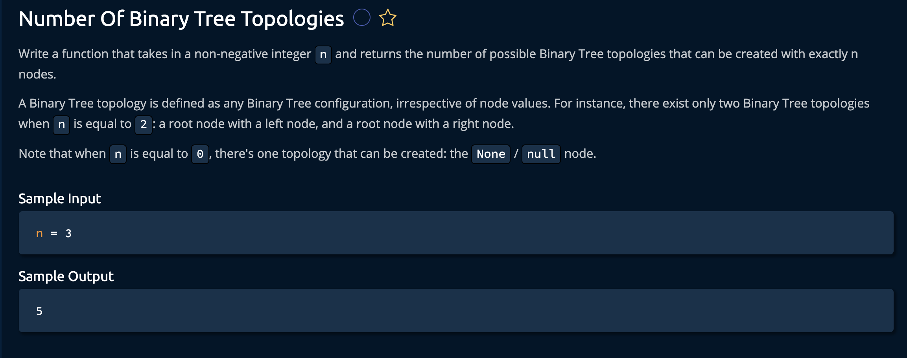

## Number Of Possible Binary Tree Topologies

#### Problem Statement

#### Explanation

We can use a Stack here

#### Solution

Check this [Python](../python/Number_Of_Binary_Tree_Topologies.py) code.

